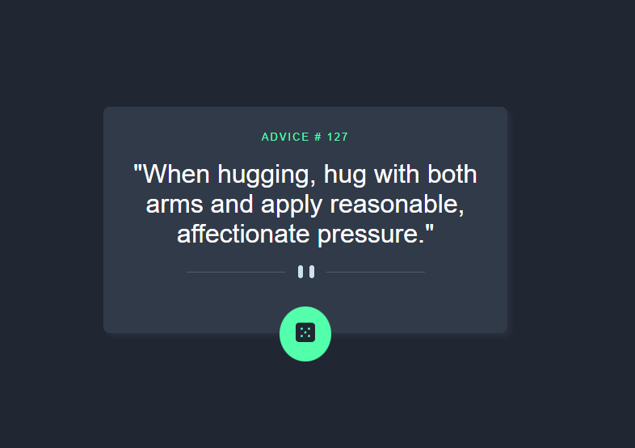

# Frontend Mentor - Advice Generator App

This is a solution to the **Advice Generator App** challenge on Frontend Mentor.  
The project fetches random advice from the Advice Slip API and displays it in a clean and responsive interface.

## Overview

### The challenge

Users should be able to:

- View a random piece of advice
- Generate new advice by clicking the dice button
- See a responsive layout depending on their device screen size
- Experience hover effects on interactive elements

### Screenshot



---

## Links

- Solution URL: [SOLUTION](https://www.frontendmentor.io/solutions/responsive-advice-generating-page-uoKIe9LKgf)
- Live Site URL: [LIVE URL](https://victor-viktor.github.io/advice-slip-project/index.html)

---

## Built with

- Semantic HTML5
- CSS3
- Flexbox
- JavaScript (ES6+)
- Fetch API
- Mobile-first workflow

---

## What I learned

During this project, I practiced:

- Working with APIs using `fetch()`
- Handling asynchronous JavaScript with `async/await`
- Manipulating the DOM dynamically
- Creating responsive layouts with CSS
- Adding hover effects and improving UI interactions

Example of the API request used:

```javascript
const response = await fetch('https://api.adviceslip.com/advice');
const quoteJson = await response.json();
```

---

## Continued development

In future versions, I would like to:

- Improve accessibility
- Add loading animations
- Improve error handling
- Refactor the JavaScript structure
- Add smoother transitions and animations

---

## Useful resources

- MDN Web Docs - Fetch API → https://developer.mozilla.org/en-US/docs/Web/API/Fetch_API
- Frontend Mentor → https://www.frontendmentor.io

---

## Author

- Frontend Mentor - [@Victor-Viktor](https://www.frontendmentor.io/profile/Victor-Viktor)
- GitHub - [@Victor-Viktor](https://github.com/Victor-Viktor)

---

## Acknowledgments

Thanks to Frontend Mentor for providing awesome real-world front-end challenges.
